[github.com/Rahul2899](https://github.com/Rahul2899)

> AI/ML and data engineer. 
> Small, sharp tools over big vague ideas.

I build things across computer vision, data analysis, and applied ML — 
from unsupervised image retrieval to city-scale incident data. Currently 
digging into AI visibility analytics and how brands show up across 
ChatGPT, Claude, Gemini and other assistants.

<samp>python &nbsp; typescript &nbsp; pytorch &nbsp; opencv &nbsp; jupyter &nbsp; javascript &nbsp; html &nbsp; git &nbsp; linux</samp>

**[berlin-bike-theft-analysis](https://github.com/Rahul2899/berlin-bike-theft-analysis)** &nbsp;·&nbsp; <samp>python</samp> 
Data analysis of 21,403 Berlin bike theft incidents, Jan 2025 – May 2026.

**[aura-ai-visibility](https://github.com/Rahul2899/aura-ai-visibility)** &nbsp;·&nbsp; <samp>typescript</samp> 
AI brand visibility analytics across ChatGPT, Claude, Gemini and more.

**[Unsupervised Image Retrieval](https://github.com/Rahul2899/Unsupervised_Image_Retrieval_for_Historical_Auction_Catalogues--_.)** &nbsp;·&nbsp; <samp>python</samp> 
Unsupervised image retrieval for historical auction catalogues.

**[AI-assistant](https://github.com/Rahul2899/AI-assistant)** &nbsp;·&nbsp; <samp>python</samp> 
AI assistant built for an IT consulting company.

Every graphic here is generated, not embedded from anyone else's server. 
`ascii.svg` is a photo pushed through a character ramp by 
[`scripts/make_portrait.py`](scripts/make_portrait.py); the stat graphics and 
these section headings are drawn by [a scheduled action](.github/workflows/stats.yml) 
straight from the GitHub GraphQL API, once a day, committing only what changed.

They animate with SMIL inside the SVG, because GitHub strips scripts from 
READMEs — and since nothing loads from a third party, nothing here can 
rate-limit or go dark. The headings are SVGs for the same reason: GitHub also 
strips CSS, so an image is the only way to put this page's own typeface on them.

The typeface is [JetBrains Mono](scripts/fonts), subset to just the characters 
each graphic draws and inlined as base64. That isn't only for looks: the 
portrait's grid assumes an advance width of exactly 0.600 em, and a viewer whose 
default monospace is narrower would otherwise see it squeezed.

Language totals cover public repositories only. `year.svg` uses the portrait's 
character ramp: `:` `+` `#` `@`, quiet to loud.
